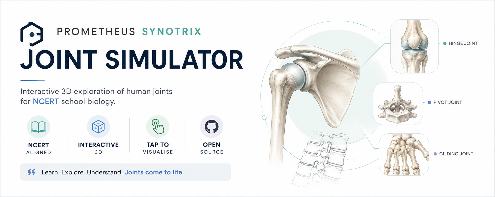

  

# 🦴 Prometheus Synotrix : Joint Simulator

Interactive 3D educational simulator for exploring human joints through intuitive visualization and animation, aligned with the latest NCERT curriculum.

---

## ✨ Features

- **Interactive 3D Models:** Rotate, zoom, and inspect human joints.
- **Joint Movement Simulation:** Visualize realistic movement of different joint types.
- **NCERT Aligned:** Designed specifically for school-level biology.
- **Inspect Mode:** Explore anatomical structures through interactive labels.
- **Educational First:** Simplified anatomical models for conceptual understanding.

---

## 🦴 Included Joint Types

- Ball-and-Socket Joint
- Hinge Joint
- Pivot Joint
- Gliding (Plane) Joint
- Cartilaginous Joint
- Fixed (Fibrous) Joint

---

## 🚀 Built With & Hosted On

- **Repository:** GitHub
- **Hosting:** Github Pages

---

## 🛠️ AI Credits & Acknowledgments

- **Moonshot AI (Kimi 2.6):** From basic widget generation to raw structured code.
- **Perplexity AI:** Code refinement and optimization.
- **OpenAI:** Prompt engineering, debugging, scientific validation, and testing.
- **Claude (Anthropic Sonnet 5):** Final code architecture, UI implementation, and application refinement.

---

## ⚠️ Educational Disclaimer

This simulator was developed for educational purposes and is aligned with the latest NCERT curriculum.

The anatomical models are simplified to improve learning and interactivity and should **not** be considered medically or anatomically exact representations.

---

## 👤 Author

**Draven Ashcroft**

- M.Sc. Ag. Entomology
- ASRB NET Qualified
- DIPS Chain of Institutions

---

## 📜 License

GPL-3.0 License
